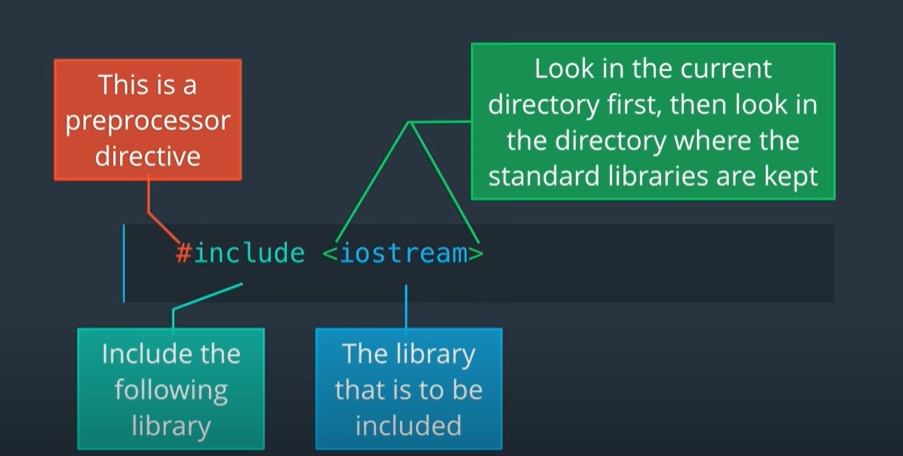

Book to be refered : C++ Programming Language 4th edition

1}Program Structure
  the c++ program structure consists of two major parts **Preprocessor Directives** & **Main Fucntion**
  
  Lets take an example of a program...
 
 ```
 #include <iostream>
 int main() 
   {
      std::cout << "Hello world, I am ready for C++";
      return 0;
   }
 ```
    
  Any word which starts with a hash sign is called the pre processor directive
  
After the hash sign we have the word include. There are several preprocessor directives available in C++, but include is the one we see and use the most often.
Include means add the declarations of the given library. In this case we are adding the declarations of the iostream library.



Important:-

You can declare the library by using either " " or < > 
The brackets ( <> ) say “Look for this file in the directory where all the standard libraries are stored”. C++ also allows us to specify the library name using double quotes.
The double quotes (" ") say “look in the current directory, if the file is not there, then look in the directory where the standard libraries are stored”.

****** How to use commnents*******

Comments helps in explaining the piece of code you have wrote and also helps other viewers and collaborators to work on it for the same....
in C++ comments are given as /*comment*/
