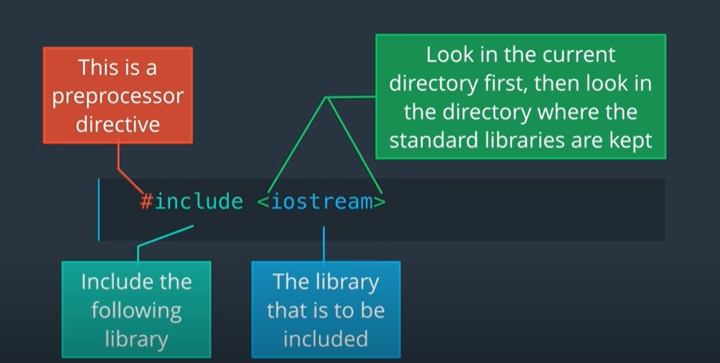

Book used for reference : C++ Programming Language 4th edition

**(1) Program Structure**
  
The c++ program structure consists of two major parts **Preprocessor Directives** & **Main Fucntion**
  
  Lets take an example of a program...
 
 ```
 #include <iostream>
 int main() 
   {
      std::cout << "Hello world, I am ready for C++";
      return 0;
   }
 ```
    
  Any word which starts with a hash sign is called the pre processor directive
  
After the hash sign we have the word include. There are several preprocessor directives available in C++, but include is the one we see and use the most often.
Include means add the declarations of the given library. In this case we are adding the declarations of the iostream library.



Important:-

You can declare the library by using either " " or < > 
The brackets ( <> ) say “Look for this file in the directory where all the standard libraries are stored”. C++ also allows us to specify the library name using double quotes.
The double quotes (" ") say “look in the current directory, if the file is not there, then look in the directory where the standard libraries are stored”.

std::cout --> (Standard) it is used to take that particular command from the library (iostream) in this case ...  cout --> prints 

**(2) How to use commnents**

Comments helps in explaining the piece of code you have wrote and also helps other viewers and collaborators to work on it for the same....
in C++ comments are given as /* comment */

Comments can be added in two ways:
- As a comment block
- As a single line

Comment block can be added as---
/* Hi This is Jerin
*** currently learning C++
*/

Single line comment can be given as ---
//Single line Quoting

**(3)Style Guide**

As with all programming languages, there are many different ways to style the code we write. For this course, we are not using a standard style. We are trying to remain consistent throughout the course, while making the codes as readable as possible.

There are a number of style guides available, the best one is the one used by the people who are paying you.

A straightforward style guide is:
               [Modern C++ Coding Guidelines](https://github.com/Microsoft/AirSim/blob/master/docs/coding_guidelines.md)

For a more detailed guideline:
               [Google C++ Style Guideline](https://google.github.io/styleguide/cppguide.html)
               
**(4) Compiling C++**
             
Now the question you are asking is … what does it mean to get it right? What did I get right?

When you click on the submit button, the program is compiled and run.


The command to compile is :
```
 g++  main.cpp -o main.out
```
G++ for the C++ compiler. The file name is main.cpp. -o is for the name of the output. Main.out is the name of the output.

To run the output file, main.out.

We run:
```
  ./main.out
```  

**(5) Using namespace**
At times using std:: can be a tad bit irritating in such cases to simplify the script "namespace std;" is used

eg:
```
#include<iostream>
using namespace std;
int main(){
cout << "Hello World!";
return 0;
}
```
There is some controversy about using namespace. When the commands are not explicitly defined, there is a possibility that when your code is added to a large project, your code might reference a command from a different library.

**(7) Adding Variables and blank lines**
Any string literal must be enclosed in double quotes. Numbers do not require double quotes. If a variable name is used, the value of the variable is printed.

We can have multiple insertions to cout.

A program snippet:
```
 int integer = 4543;
 std::cout<<”The value of integer is “<<integer<<"\n";
```
Output: The value of integer is 4543

Also, note that cout does not automatically add newlines. You must add them using the escape sequence “\n”

**(8) printing variable size**
As with other programming languages, the size a variable is allocated in memory is dependent upon its type. To determine how many bytes each variable type uses, C++ provides the function sizeof(variableType)
